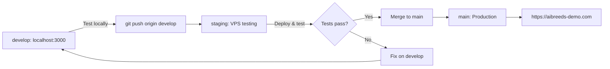

# Git Branch Strategy & Workflow

## ✅ Branch Purpose (Phase 3 Strategy)

According to [projectplan.md](projectplan.md) Phase 3, we maintain a three-tier branch structure:

| Branch | Purpose | Environment | URL | Who Uses |
|--------|---------|-------------|-----|----------|
| **`develop`** | Active development | Local laptop | `localhost:3000` | Developers |
| **`staging`** | Pre-production testing | VPS (test) | `http://159.223.63.117` or staging subdomain | QA/Testing |
| **`main`** | Production | VPS (live) | `https://aibreeds-demo.com` | End users |

---

## 🔄 Proper Workflow (Intended)

### **Standard Development Cycle**



### **Step-by-Step Process**

#### 1. **Develop Locally** (on `develop` branch)
```bash
# Switch to develop branch
git checkout develop

# Make your changes
# ... edit files ...

# Test locally
npm run dev
# Open http://localhost:3000 and test

# Commit changes
git add .
git commit -m "feat: Your feature description"
git push origin develop
```

**Purpose**: Rapid iteration on your laptop, test with `.env.local`

---

#### 2. **Test on Staging** (merge to `staging` branch)
```bash
# Merge develop → staging
git checkout staging
git merge develop
git push origin staging

# Deploy to VPS (staging environment)
ssh root@159.223.63.117 << 'EOF'
cd /root/pets
git fetch origin
git checkout staging
git pull origin staging
docker compose -f docker-compose.staging.yml up -d --build
EOF

# Test on VPS via IP
curl http://159.223.63.117/api/health
# Or browse: http://159.223.63.117
```

**Purpose**: Test on actual VPS hardware, internet connectivity, different network conditions

**What to verify**:
- ✅ Docker build succeeds on VPS
- ✅ All environment variables loaded correctly
- ✅ LLM providers work from VPS location
- ✅ All 10 languages display correctly
- ✅ Mobile responsiveness (test on physical devices)
- ✅ Performance acceptable (load times, API responses)

---

#### 3. **Deploy to Production** (merge to `main` branch)
```bash
# Only after staging tests pass!
git checkout main
git merge staging
git push origin main

# Deploy to production
ssh root@159.223.63.117 << 'EOF'
cd /root/pets
git fetch origin
git checkout main
git pull origin main
docker compose up -d --build
EOF

# Verify production
curl https://aibreeds-demo.com/api/health
```

**Purpose**: Serve live users with tested, stable code

---

## 🚨 Current Situation (January 21, 2026)

**What We Did Wrong:**
- ❌ Pushed all changes directly to `main` (bypassed staging)
- ❌ No testing on `staging` branch
- ❌ `develop` and `staging` branches were outdated

**What We Fixed:**
- ✅ Synced `develop` and `staging` with `main` (all up to date now)
- ✅ Documented proper workflow
- ✅ Ready to follow Phase 3 strategy going forward

---

## 📋 Quick Reference Commands

### **Daily Development Workflow**

```bash
# 1. Start work on develop
git checkout develop
git pull origin develop

# 2. Make changes and test locally
npm run dev

# 3. Commit and push to develop
git add .
git commit -m "feat: Description"
git push origin develop

# 4. Merge to staging for VPS testing
git checkout staging
git merge develop
git push origin staging

# 5. Deploy to staging VPS
ssh root@159.223.63.117 'cd /root/pets && git checkout staging && git pull && docker compose -f docker-compose.staging.yml up -d --build'

# 6. After staging tests pass, deploy to production
git checkout main
git merge staging
git push origin main

# 7. Deploy to production VPS
ssh root@159.223.63.117 'cd /root/pets && git checkout main && git pull && docker compose up -d --build'
```

---

## 🎯 Environment-Specific Configurations

### **Local Development (develop branch)**
- **Branch**: `develop`
- **Environment File**: `.env.local`
- **URL**: `localhost:3000`
- **Docker**: Not used (run `npm run dev`)
- **Purpose**: Fast iteration, debugging, new features

### **Staging (staging branch)**
- **Branch**: `staging`
- **Environment File**: `.env.staging`
- **URL**: `http://159.223.63.117` (or staging.aibreeds-demo.com if configured)
- **Docker**: `docker-compose.staging.yml`
- **Purpose**: Integration testing, VPS environment validation

### **Production (main branch)**
- **Branch**: `main`
- **Environment File**: `.env` (created from `.env.production.template`)
- **URL**: `https://aibreeds-demo.com`
- **Docker**: `docker-compose.yml`
- **Purpose**: Live site for end users

---

## 🔐 Security & Best Practices

### **What Goes in Each Branch**

**All Branches (develop, staging, main):**
- ✅ Source code
- ✅ Configuration templates (`.env.production.template`, `.env.staging`)
- ✅ Documentation
- ✅ Docker files

**NEVER Commit (any branch):**
- ❌ `.env.local` (real API keys for local dev)
- ❌ `.env` (actual production environment file)
- ❌ Any file with real API credentials

### **Branch Protection (Recommended)**

On GitHub, configure:
- **`main`**: Require pull request reviews before merging
- **`staging`**: Require status checks to pass
- **`develop`**: Open for direct commits

---

## 🐛 Troubleshooting

### **"I made changes directly on main, now what?"**
```bash
# Create feature branch from main
git checkout -b fix/my-urgent-fix main
# Make your fixes
git add .
git commit -m "fix: Description"

# Merge to staging first
git checkout staging
git merge fix/my-urgent-fix
git push origin staging
# Test on staging VPS

# Then merge to main
git checkout main
git merge fix/my-urgent-fix
git push origin main
```

### **"Staging and main are out of sync"**
```bash
# Sync staging from main
git checkout staging
git merge main
git push origin staging

# Or sync main from staging (if staging is ahead)
git checkout main
git merge staging
git push origin main
```

### **"How do I check which branch the VPS is on?"**
```bash
ssh root@159.223.63.117 'cd /root/pets && git branch --show-current'
```

---

## 📚 Related Documentation

- **Project Plan**: [projectplan.md](projectplan.md) - Phase 3 deployment strategy
- **Deployment Workflow**: [DEPLOYMENT-WORKFLOW.md](DEPLOYMENT-WORKFLOW.md) - Environment file management
- **VPS Guide**: [VPS-DEPLOYMENT-GUIDE.md](VPS-DEPLOYMENT-GUIDE.md) - Detailed deployment steps
- **Quick Reference**: [QUICK-DEPLOY-REFERENCE.md](QUICK-DEPLOY-REFERENCE.md) - Common commands

---

**Last Updated**: January 21, 2026  
**Status**: ✅ All branches synced and ready for proper workflow
